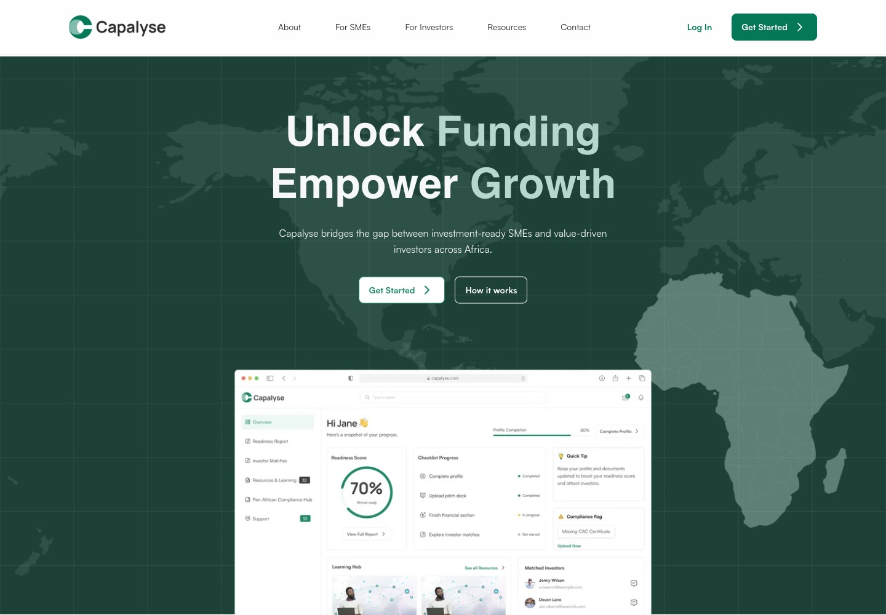

# Capalyse

Capalyse is a Next.js frontend connecting African SMEs, investors, and development organisations. It includes public product pages, role-based registration and profile completion, investment-readiness assessments, SME discovery, programs, deal flow, messaging, and administration screens.

The frontend depends on a separately operated API and Better Auth service; this repository does not include the backend. Some screens include placeholder content, so a successful build does not establish that every workflow is connected to a live service.

## Local setup

Use **Node.js 22.x** and npm. The npm lockfile is the canonical install used by CI and Docker.

```sh
git clone https://github.com/chiKeka/capalyse.git
cd capalyse
npm ci
```

Create `.env.local` with your development service URLs:

```dotenv
NEXT_PUBLIC_API_URL=http://localhost:8000
NEXT_PUBLIC_BETTER_AUTH_URL=http://localhost:8000
# Optional: separate agent API; otherwise uses NEXT_PUBLIC_API_URL
NEXT_PUBLIC_AGENT_API_URL=http://localhost:8000
# Required only for the Cloudinary upload flows:
NEXT_PUBLIC_CLOUDINARY_CLOUD_NAME=
NEXT_PUBLIC_CLOUDINARY_PRESET=
```

All `NEXT_PUBLIC_*` values are browser-visible configuration. Use an unsigned upload preset intended for client uploads; never put API secrets in these variables. The backend must support the frontend origin and credentialed requests. Authentication uses `/api/v1/auth` on the Better Auth base URL.

```sh
npm run dev
# Open http://localhost:3000
```

The public homepage can be previewed without signing in. Dashboard workflows require a compatible backend and a development account. Registration profile completion lives at `/{sme|investor|development}/onboarding`; the additional dashboard tour lives at `/{role}/getting-started`.

## Validation and production build

```sh
npm run lint
npx tsc --noEmit
NEXT_TELEMETRY_DISABLED=1 npm run build
npm run start
```

These commands were verified with Node 22. Lint retains existing warnings about image accessibility/optimization and effect dependencies. The build downloads Geist fonts from Google, so first builds need access to Google Fonts as well as the npm registry for installation. Local fonts also live in `src/fonts/`.

Next emits standalone output. To run the standalone server, copy its static assets first:

```sh
cp -R public .next/standalone/public
mkdir -p .next/standalone/.next
cp -R .next/static .next/standalone/.next/static
PORT=3000 HOSTNAME=0.0.0.0 node .next/standalone/server.js
```

Set public environment variables **before building**; setting them only on the running container will not replace browser-bundled values.

```sh
docker build \
  --build-arg NEXT_PUBLIC_API_URL=http://localhost:8000 \
  --build-arg NEXT_PUBLIC_BETTER_AUTH_URL=http://localhost:8000 \
  -t capalyse-app:local .
docker run --rm -p 3000:3000 capalyse-app:local
```

The Docker recipe uses Node 22 and the npm lockfile. Its execution has not been verified locally because the Docker daemon was unavailable. The CI Docker stage runs only on `main`, after lint/type/build; the separate deployment workflow publishes on pushes to `main`.

## Public preview



This screenshot is from an anonymous local production build using only checked-in public assets, with external requests blocked. The dashboard illustration embedded in the hero is an already-public checked-in mockup; no live dashboard records, account details, or private API data were fetched. The repository's metadata names `capalyse.com`, but this README does not claim that a live demo has been verified.

## Code map

- `src/app/`: public pages, auth flows, role dashboards, and admin routes.
- `src/hooks/`: React Query queries and mutations.
- `src/api/`: Axios clients and backend endpoint paths.
- `src/components/`: layouts, forms, and shared UI.
- `.github/workflows/`: CI and container publication.

No project-wide license file is currently included. Existing source and asset notices remain unchanged; this README does not grant new licensing rights.
